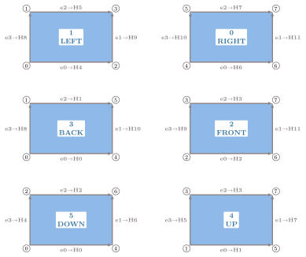

# FVMAdapt Numbering Conventions {#fvmadapt_numbering}

FVMAdapt helper classes use local numbering. These numbers are not global mesh
entity IDs. They are the local slots used while the code builds and replays
edge, face, and cell refinement trees.

The coordinate names below are local reference directions. They are not physical
`x`, `y`, and `z` coordinates from the mesh.

## QuadFace

A `QuadFace` has four corner-node positions and four boundary-edge positions.
Both are numbered from 0. In the C++ class, edge number `n` is stored in
`edge[n]`.

The face-local origin is corner node 0. Face-local x points from node 0 to node
1 . Face-local y points from node 0 to node 3 .

The boundary-edge numbers are:

- edge 0: node 0 to node 1
- edge 1: node 1 to node 2
- edge 2: node 3 to node 2
- edge 3: node 0 to node 3

## HexCell

A `HexCell` is made of six quad faces. The face slots are named by the
constant local coordinate on that face:

| Face | Direction name | Local coordinate |
| --- | --- | --- |
| `0` | `RIGHT` | `xi = 1` |
| `1` | `LEFT` | `xi = 0` |
| `2` | `FRONT` | `eta = 1` |
| `3` | `BACK` | `eta = 0` |
| `4` | `UP` | `zeta = 1` |
| `5` | `DOWN` | `zeta = 0` |

The local node numbering is:

| Node | `xi` | `eta` | `zeta` |
| --- | --- | --- | --- |
| 0 | 0 | 0 | 0 |
| 1 | 0 | 0 | 1 |
| 2 | 0 | 1 | 0 |
| 3 | 0 | 1 | 1 |
| 4 | 1 | 0 | 0 |
| 5 | 1 | 0 | 1 |
| 6 | 1 | 1 | 0 |
| 7 | 1 | 1 | 1 |

Equivalently, the local node number is `4*xi + 2*eta + zeta` for `xi`, `eta`,
and `zeta` values of 0 or 1 .

## Hex Faces as QuadFace Views

Each `HexCell` face can be viewed as a `QuadFace`. The diagram below peels the
six faces away from the cell. The center of each square gives the HexCell face
number and direction name. The corner labels are the HexCell node numbers on
that face.

The arrows use the same QuadFace edge directions shown in the QuadFace diagram:
bottom, right, top, and left. The edge labels show how each face-local edge
maps to a HexCell edge. For example, `e0 -> H4` means face-local edge `e0`
maps to hex edge `H4`. This is the cell-local view used after mesh faces have
been put into the HexCell's local order.
