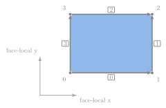
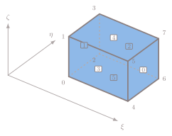
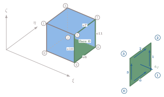

# FVMAdapt Numbering Conventions {#fvmadapt_numbering}

FVMAdapt uses local numbering for each refinement entity. These numbers are not
global mesh entity IDs. They label positions within one edge, face, or cell
refinement tree as that tree is built and replayed.

The coordinate names below are local reference directions. They are not physical
`x`, `y`, and `z` coordinates from the mesh, and they do not imply orthogonal
axes or equal edge lengths. They identify ordered node, edge, face, and child
positions used to interpret split codes, child ordering, and face/edge
mappings.

The diagrams below show canonical reference shapes, not a claim that the
physical mesh cells are squares or cubes. A skewed quadrilateral still has the
same local `x` and `y` directions; those directions follow the deformed physical
edges.

When the entity type matters, this page uses subscripts for the entity family
and superscripts for the local number. For example,
nq(0) is QuadFace-local node zero, and
eH(6) is HexCell-local edge six.

## QuadFace

A `QuadFace` has four corner-node positions and four boundary-edge positions.
Both are numbered from zero. These positions define the face-local reference view
used by `QuadFace` split codes.

The face-local origin is nq(0). Face-local `x` points
from nq(0) to nq(1); face-local
`y` points from nq(0) to
nq(3).

This describes local ordering only. The physical edges from
nq(0) to nq(1) and from
nq(0) to nq(3) do not have to be
perpendicular.

The boundary-edge numbers are:

- eq(0): nq(0) to nq(1)
- eq(1): nq(1) to nq(2)
- eq(2): nq(3) to nq(2)
- eq(3): nq(0) to nq(3)

## HexCell

A `HexCell` is made of six quad faces. Its local view is a reference
hexahedron. Node nH(0) is the cell-local origin with
`(xi, eta, zeta) = (0, 0, 0)`. A physical hexahedron can be skewed or
stretched; the local coordinates below name positions in the reference shape.

The face numbers are named by the constant local coordinate on that face:

In the above diagram, numbers bounded by squares are HexCell face numbers
fH(i), and the unboxed numbers are HexCell node numbers
nH(i).

| HexCell face | Local coordinate |
| --- | --- |
| fH(0) | `xi = 1` |
| fH(1) | `xi = 0` |
| fH(2) | `eta = 1` |
| fH(3) | `eta = 0` |
| fH(4) | `zeta = 1` |
| fH(5) | `zeta = 0` |

The local node numbering is:

| HexCell node | `xi` | `eta` | `zeta` |
| --- | --- | --- | --- |
| nH(0) | 0 | 0 | 0 |
| nH(1) | 0 | 0 | 1 |
| nH(2) | 0 | 1 | 0 |
| nH(3) | 0 | 1 | 1 |
| nH(4) | 1 | 0 | 0 |
| nH(5) | 1 | 0 | 1 |
| nH(6) | 1 | 1 | 0 |
| nH(7) | 1 | 1 | 1 |

Equivalently, the local node number is `4*xi + 2*eta + zeta` for `xi`, `eta`,
and `zeta` values of zero or one.

The `HexCell` also has 12 local edges. These are HexCell-local edge ids, not
global mesh edge ids. The implementation numbers them by their endpoint nodes:

| HexCell edge | Endpoints |
| --- | --- |
| eH(0) | nH(0) to nH(4) |
| eH(1) | nH(1) to nH(5) |
| eH(2) | nH(2) to nH(6) |
| eH(3) | nH(3) to nH(7) |
| eH(4) | nH(0) to nH(2) |
| eH(5) | nH(1) to nH(3) |
| eH(6) | nH(4) to nH(6) |
| eH(7) | nH(5) to nH(7) |
| eH(8) | nH(0) to nH(1) |
| eH(9) | nH(2) to nH(3) |
| eH(10) | nH(4) to nH(5) |
| eH(11) | nH(6) to nH(7) |

## Face-Local Orientation

A mesh face also has its own `face2node` order. That order can start at a
different corner of the same physical face, and it can run around the face in
the opposite direction from the `HexCell` view. The cyclic order, and therefore
the normal associated with that order, is what fixes the face-local
orientation. Node `0` alone is not enough.

The examples below use fH(0), the `xi = 1` face. The left
side of each figure shows the face in the HexCell, with HexCell node numbers
and HexCell edge numbers on the highlighted face. The projected copy shows one
possible QuadFace-local view of that same physical face. On the projected copy,
the blue node and edge labels are QuadFace-local numbers, and the blue arrows
show QuadFace-local edge directions.

<em>QuadFace-local node zero lands on HexCell node four, and the local edge
directions follow that orientation.</em>

<em>The same face-local orientation has been rotated so that QuadFace-local node
zero lands on HexCell node six.</em>

<em>Here QuadFace-local node zero is back on HexCell node four, but the local
edge directions are reversed, so the face-local normal points in the opposite
direction.</em>

When a hex cell is built, FVMAdapt compares the mesh face's `face2node` order
with the HexCell face order and records the result as `hexOrientCode`. That
orientation code is used when face plans are applied to cells, so split codes,
child ids, and edge ids refer to the same physical subfaces even when the
face-local and cell-local views differ.
