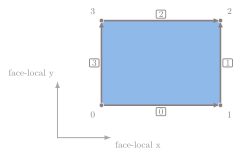
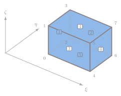
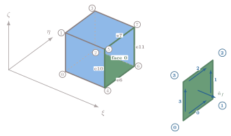

# FVMAdapt Numbering Conventions {#fvmadapt_numbering}

FVMAdapt uses local numbering for each refinement entity. These numbers are not
global mesh entity IDs. They label positions in the local topology of one edge,
face, or cell as its refinement tree is built and replayed.

The coordinate names below are local reference directions. They are not physical
`x`, `y`, and `z` coordinates from the mesh, and they do not imply orthogonal
axes or equal edge lengths. They identify ordered node, edge, face, and child
positions used to interpret split codes, child ordering, and face/edge
mappings.

The diagrams below show canonical reference shapes, not a claim that the
physical mesh cells are squares or cubes. A skewed quadrilateral still has the
same local `x` and `y` directions; those directions follow the deformed physical
edges.

When the entity type matters, this page uses subscripts for the entity family
and superscripts for the local number. For example,
nq(0) is QuadFace-local node zero, and
eH(6) is HexCell-local edge six. So the subscript identifies
the entity type and the superscript identifies the local number within that entity.
The letter `n` is used for nodes, `e` for edges, and `f` for faces.

## QuadFace

A `QuadFace` has four corner-node positions and four boundary-edge positions.
Both are numbered from zero. These positions define the face-local reference view
used by `QuadFace` split codes. Consider the figure below that a `QuadFace`
and how it is numbered with regards to nodes and edges in the face's local
coordinate system.

The face-local origin is nq(0). Face-local `x` points
from nq(0) to nq(1); face-local
`y` points from nq(0) to
nq(3).

This describes local ordering only. The physical edges from
nq(0) to nq(1) and from
nq(0) to nq(3) do not have to be
perpendicular.

The boundary-edge numbers are:

- eq(0) : nq(0) to nq(1)
- eq(1) : nq(1) to nq(2)
- eq(2) : nq(3) to nq(2)
- eq(3) : nq(0) to nq(3)

## HexCell

A `HexCell` is made of six quad faces. Its local view is a reference
hexahedron. Node nH(0) is the cell-local origin with
`(xi, eta, zeta) = (0, 0, 0)`. A physical hexahedron can be skewed or
stretched; the local coordinates below name positions in the reference shape.
The diagram shows only the HexCell reference topology and local numbering. A
physical HexCell may be skewed or stretched; it need not be a cube or an
orthogonal rectangular prism.

The face numbers are named by the constant local coordinate on that face. The
face numbers are written inside boxes in the diagram below. The node numbers
are written without boxes. The face numbers are expressed elsewhere in the text
as fH(i) for face `i`, and the node numbers are expressed as
nH(i) for node `i`.

| HexCell face | Local coordinate |
| --- | --- |
| fH(0) | `xi = 1` |
| fH(1) | `xi = 0` |
| fH(2) | `eta = 1` |
| fH(3) | `eta = 0` |
| fH(4) | `zeta = 1` |
| fH(5) | `zeta = 0` |

The local node numbering is:

| HexCell node | `xi` | `eta` | `zeta` |
| --- | --- | --- | --- |
| nH(0) | 0 | 0 | 0 |
| nH(1) | 0 | 0 | 1 |
| nH(2) | 0 | 1 | 0 |
| nH(3) | 0 | 1 | 1 |
| nH(4) | 1 | 0 | 0 |
| nH(5) | 1 | 0 | 1 |
| nH(6) | 1 | 1 | 0 |
| nH(7) | 1 | 1 | 1 |

Equivalently, the local node number is `4*xi + 2*eta + zeta` for `xi`, `eta`,
and `zeta` values of zero or one.

The `HexCell` also has 12 local edges. These are HexCell-local edge ids, not
global mesh edge ids. Each local edge number identifies the two HexCell-local
nodes it connects. The implementation stores these endpoints as the edge’s
head and tail nodes:

| HexCell edge | Endpoints (`head` to `tail`) |
| --- | --- |
| eH(0) | nH(0) to nH(4) |
| eH(1) | nH(1) to nH(5) |
| eH(2) | nH(2) to nH(6) |
| eH(3) | nH(3) to nH(7) |
| eH(4) | nH(0) to nH(2) |
| eH(5) | nH(1) to nH(3) |
| eH(6) | nH(4) to nH(6) |
| eH(7) | nH(5) to nH(7) |
| eH(8) | nH(0) to nH(1) |
| eH(9) | nH(2) to nH(3) |
| eH(10) | nH(4) to nH(5) |
| eH(11) | nH(6) to nH(7) |

## Face-Local Orientation

A mesh face also has its own `face2node` order. That order can start at a
different corner of the same physical face, and it can run around the face in
the opposite direction from the `HexCell` view. The cyclic order, and therefore
the normal associated with that order, is what fixes the face-local
orientation. Node `0` alone is not enough.

The examples below use fH(0), the `xi = 1` face. The left
side of each figure shows the face in the HexCell, with HexCell node numbers
and HexCell edge numbers on the highlighted face. The projected copy shows one
possible QuadFace-local view of that same physical face. On the projected copy,
the blue node and edge labels are QuadFace-local numbers, and the blue arrows
show QuadFace-local edge directions.

In the diagram above, the QuadFace-local node zero lands on HexCell node four,
and the local edge directions follow that orientation. From here, we can already
see the importance of maintaining a ledger that keeps track of the different
numbering/naming schemes for the nodes and edges between the face and the cell
as things can quickly get confusing.

Consider below, a different possible configuration that might arise where in
this case the face has been rotated -90 degrees about the xi axis. The HexCell
remains the same in this case. In this case the QuadFace-local node
zero lands on HexCell node six

As a final example here, consider that when two cells share a common face, that
face has an orientation that is dictated by the face normal vector. In the two
examples above the face normal vector was pointing away from the HexCell. In
the example below that face normal now points into the HexCell. The node 0 of
the QuadFace is back on HexCell node four, like our first example, but you can
see that the local node numbers are different. You can create this face from
the first example by rotating it 180 degrees along the eta axis, and then
rotating it again 90 degrees along the xi axis.

These examples simply illustrate the complexity of ensuring that the descriptions
of the nodes, edges, face, and cells are consistent between the different local views.

When a hex cell is built, FVMAdapt compares the mesh face's `face2node` order
with the HexCell face order and records the result as `hexOrientCode`. That
orientation code is used when face plans are applied to cells, so split codes,
child ids, and edge ids refer to the same physical subfaces even when the
face-local and cell-local views differ.
