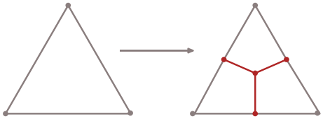
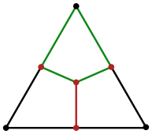
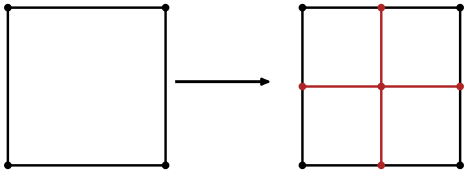
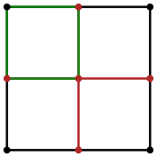
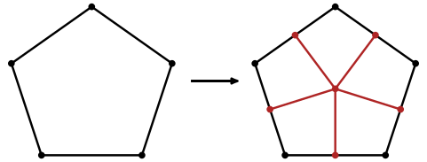
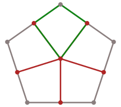
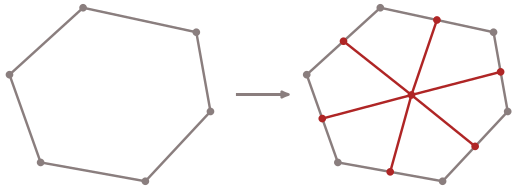
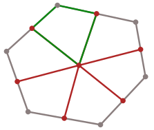

# FVMAdapt Geometric Splitting Reference {#fvmadapt_geometric_splitting}

This page expands the splitting terminology used by the [FVMAdapt Mesh Adaptation Overview](@ref fvmadapt_overview). It collects the detailed isotropic and anisotropic split types separately so the overview can stay focused on the main adaptation flow.

## Midpoint Splitting Strategy

For an N-faced element that has E edges and V nodes:
  - Insert a new node at the centroid of the element.
  - Connect that node to the centroid nodes of all the faces of the element.
  - This will create V new elements from the original element.

### Face Splitting

An n-sided face is split into n quadrilateral child faces by inserting a node
at the face centroid, splitting each edge at its midpoint, and connecting the
face centroid to each edge midpoint.

1. Each edge of the face is split by inserting a node at the midpoint.
2. A node is inserted at the centroid of the face.
3. The face-centroid node is connected to each edge-midpoint node.
4. Each original vertex forms one quadrilateral child face with the two
   neighboring edge midpoints and the face centroid.

The face formalism is simpler than the cell formalism. A general polygonal
`Face` supports isotropic refinement: an n-edge parent face becomes n
quadrilateral child faces. There is also a specialized `QuadFace` form for
quadrilateral faces on the hexahedron and prism anisotropic paths. In the
isotropic face split shown here, the result is still quadrilateral child faces;
there is not a separate face analogue of `DiamondCell`.

| Parent face | Library handling | Isotropic split result |
| --- | --- | --- |
| Triangle | General polygonal `Face` | 3 quadrilateral child faces |
| Quadrilateral | General polygonal `Face`, or `QuadFace` on anisotropic cell paths | 4 quadrilateral child faces |
| Pentagon | General polygonal `Face` | 5 quadrilateral child faces |
| n-sided polygon | General polygonal `Face` | n quadrilateral child faces |

The same rule applies to every polygonal face. The examples below show the full
split and then highlight one of the quadrilateral child faces.

#### Triangle Face

A triangular face has 3 edges, so 3 new nodes are inserted at the edge
midpoints and a new node is inserted at the face centroid.

Below in green is one quadrilateral child face created from the triangular
parent face.

#### Quadrilateral Face

A quadrilateral face has 4 edges, so 4 new nodes are inserted at the edge
midpoints and a new node is inserted at the face centroid.

Below in green is one quadrilateral child face created from the quadrilateral
parent face.

#### Pentagon Face

A pentagonal face has 5 edges, so 5 new nodes are inserted at the edge
midpoints and a new node is inserted at the face centroid.

Below in green is one quadrilateral child face created from the pentagonal
parent face.

#### General Polygonal Face

An n-sided general polygonal face has n edges, so n new nodes are inserted at
the edge midpoints and a new node is inserted at the face centroid.

Below in green is one quadrilateral child face created from the general
polygonal parent face.

## Isotropic Cell Splitting Strategy

The child cells that are formed when a parent standard canonical cell shape is split using the isotropic splitting strategy can be categorized. Below are the various cell types and a description of how they are split and what they are split into.

### Hexahedron

When split isotropically, the hexahedral cells split into 8 hexahedral cells. Consider the hexahedron cell below.

 

To reiterate the refinement strategy, a midpoint is placed in the middle of the hexehedral cell, then a midpoint is placed in the middle of all of the faces of the cell, and then finally a midpoint is placed at the middle of every edge of the cell. In the diagram below, the green lines are the new edges that that connect the newly inserted midpoints on the face to the cell midpoint. And the red points are the midpoints placed onto the faces and the edges. The red lines are the lines that connect the inserted midpoints on the edges to the midpoint of a face.

 

Below is an animation showing the child cells that are generated from splitting the parent hexahedron cell.

 

### Tetrahedron

When split isotropically, the tetrahedral cells split into 4 hexahedral cells. Consider the tetrahedron cell below.

 

The diagram below shows the isotropic splitting stragegy applied to a tetrahedron cell.

 

Below is an animation showing the child cells that are generated from splitting the parent tetrahedron cell.

 

### Prism

When split isotropically, the prism cells split into 6 hexahedral cells. Consider the prism cell below.

 

The diagram below shows the isotropic splitting stragegy applied to a prism cell.

 

Below is an animation showing the child cells that are generated from splitting the parent prism cell.

 

### Pyramid

When split isotropically, the pyramid cells split into 4 hexahedral cells and 1 diamond cell. Consider the pyramid cell below.

 

The diagram below shows the isotropic splitting stragegy applied to a pyramid cell.

 

Below is an animation showing the child cells that are generated from splitting the parent pyramid cell.

 

### Summary

With this isotropic midpoint splitting behavior, there is a tendency towards
hexahedral topology as refinement is applied. In this module, `hexahedral`
means the child has hexahedron connectivity: eight vertices and six
quadrilateral faces. It does not mean the physical angles are 90 degrees or
that the child is a regular cube.

The `-hedron` names are singular cell-shape names: one hexahedron, one
tetrahedron, one polyhedron. The `-hedra` names are their plurals:
hexahedra, tetrahedra, polyhedra. This page usually names the singular parent
shape in headings and uses `children` for the cells produced by a split.

FVMAdapt separates the shape name from the refinement path used to refine it.
Recognized hexahedra use the `HexCell` path. Recognized triangular prisms use
the `Prism` path. Tetrahedra, pyramids, and other polyhedra use the general
`Cell` path.

| Parent shape | Refinement path | Local split rule | Isotropic child topology |
| --- | --- | --- | --- |
| Hexahedron | `HexCell` | Split in all three local directions. | 8 hexahedral children. |
| Tetrahedron | General `Cell` | Four children are created: one 3-fold `DiamondCell` at each vertex. | 4 hexahedral children. |
| Triangular prism | `Prism` | A normal prism has `nfold = 3`; the isotropic case creates `2*nfold` children. | 6 hexahedral children. |
| Pyramid | General `Cell` | Five children are created: one 3-fold `DiamondCell` at each of the four base vertices, and one 4-fold `DiamondCell` at the apex. | 4 hexahedral children + 1 higher-fold diamond child. |
| Other polyhedron | General `Cell` | One `DiamondCell` child is created at each original vertex. The child's fold is the number of original edges incident on that vertex. | One diamond child per original vertex; each child has `2*fold` faces. |

The diamond fold is local to one `DiamondCell`, not a single value for the
whole parent shape and not the number of children. A 3-fold `DiamondCell` has
six quadrilateral faces and is topologically hexahedral. A 4-fold
`DiamondCell` has eight quadrilateral faces. This is why a tetrahedron can be
described as producing four hexahedral children even though the general path
actually constructs four `DiamondCell` objects, each with fold 3. Likewise, a
pyramid produces five `DiamondCell` objects: four base-vertex children with
fold 3, plus one apex child with fold 4.

A 3-fold `DiamondCell` is hexahedral by topology, but it is not handled as a
`HexCell`; it remains a `DiamondCell` produced by the general `Cell` path.

For a fold `n` `DiamondCell`, the topology is:

- nodes: `2*n + 2`
- faces: `2*n`
- edges: `4*n`

| Diamond fold | Nodes | Faces | Edges | Related shape or use |
| --- | --- | --- | --- | --- |
| 3-fold | 8 | 6 | 12 | Hexahedral topology, but still a `DiamondCell`, not a `HexCell`. |
| 4-fold | 10 | 8 | 16 | Pyramid apex child; an eight-faced diamond. |
| 5-fold | 12 | 10 | 20 | General-cell child around a five-valent parent vertex. |
| 6-fold | 14 | 12 | 24 | General-cell child around a six-valent parent vertex. |
| n-fold | `2*n + 2` | `2*n` | `4*n` | General formula for a `DiamondCell` produced by the general `Cell` path. |

Only the 3-fold case has the same topology as a hexahedron. Higher-fold
diamonds are best described by their fold.

## Anisotropic Splitting Strategy

Anisotropic refinement can be driven by edge or direction choices. This allows for a splitting that has a preferential direction. This is often related to cells that are in a boundary layer for example, where an isotropic splitting generates cells that are numerically unecessary. In a boundary layer for example, the direction perpendicular to the surface where the boundary layer cells are placed is the direction where additional resolution enhances the solution.

Cells such as the hexahedra and prisms can be split in special ways. A way of accounting for this information is to use special codes that can indicate the type of splitting to perform.

### Hexahedron

For the hexahedron shape, we can consider several ways of splitting the shape anisotropically. Here, we can use the idea of the split codes to keep things nicely accounted for. If we think of a hexahedral cell on a general set of coordinates (for simplicity you can think of x as xi, y and eta, and z as zeta).

* 0: no split.
* 1: split in the zeta direction. This creates two child hexahedra.
* 2: split in the eta direction. This creates two child hexahedra.
* 3: split in the eta and zeta directions. This creates four child hexahedra.
* 4: split in the xi direction. This creates two child hexahedra.
* 5: split in the xi and zeta directions. This creates four child hexahedra.
* 6: split in the xi and eta directions. This creates four child hexahedra.
* 7: split in all three directions. This is treated as the isotropic hexahedron case.

### Zeta Split(1)

For this split type, a set of edges aligned in the zeta direction are split using a midpoint splitting strategy. For one of the quadrilaterial faces of the hexahedra, this looks like two edges on the sides aligned with the zeta direction getting split and their newly inserted midpoints being connected with a new line. Below is a diagram showing the splitting and connection strategy for this type of splitting.

 

Below is an animation showing the children cells that are generated from this split.

 

### Eta Split(2)

For this split type, a set of edges aligned in the eta direction are split using a midpoint splitting strategy. For one of the quadrilaterial faces of the hexahedra, this looks like two edges on the sides aligned with the eta direction getting split and their newly inserted midpoints being connected with a new line. Below is a diagram showing the splitting and connection strategy for this type of splitting.

 

Below is an animation showing the children cells that are generated from this split.

 

### Eta + Zeta Split(3)

For this split type, a set of edges aligned in the eta and zeta directions are split using a midpoint splitting strategy. This is a combination of two of the single-dimension splitting strategies. For one of the quadrilaterial faces of the hexahedra, this looks like two edges on the sides aligned with the eta and zeta directions getting split and their newly inserted midpoints being connected with a new line. Below is a diagram showing the splitting and connection strategy for this type of splitting.

 

Below is an animation showing the children cells that are generated from this split.

 

### Xi Split(4)

For this split type, a set of edges aligned in the xi direction are split using a midpoint splitting strategy. For one of the quadrilaterial faces of the hexahedra, this looks like two edges on the sides aligned with the xi direction getting split and their newly inserted midpoints being connected with a new line. Below is a diagram showing the splitting and connection strategy for this type of splitting.

 

Below is an animation showing the children cells that are generated from this split.

 

### Xi + Zeta Split(5)

For this split type, a set of edges aligned in the xi and zeta directions are split using a midpoint splitting strategy. This is a combination of two of the single-dimension splitting strategies. For one of the quadrilaterial faces of the hexahedra, this looks like two edges on the sides aligned with the xi and zeta directions getting split and their newly inserted midpoints being connected with a new line. Below is a diagram showing the splitting and connection strategy for this type of splitting.

 

Below is an animation showing the children cells that are generated from this split.

 

### Xi + Eta Split(6)

For this split type, a set of edges aligned in the xi and eta directions are split using a midpoint splitting strategy. This is a combination of two of the single-dimension splitting strategies. For one of the quadrilaterial faces of the hexahedra, this looks like two edges on the sides aligned with the xi and eta directions getting split and their newly inserted midpoints being connected with a new line. Below is a diagram showing the splitting and connection strategy for this type of splitting.

 

Below is an animation showing the children cells that are generated from this split.

 

Of course a xi + eta + zeta splitting would just be the original isotropic midpoint splitting strategy, so it isn't shown here.
