# FVMAdapt Geometric Splitting Reference {#fvmadapt_geometric_splitting}

This page expands the splitting terminology used by the [FVMAdapt Mesh Adaptation Overview](@ref fvmadapt_overview). It collects the detailed isotropic and anisotropic split types separately so the overview can stay focused on the main adaptation flow.

## Cell Splitting

The child cells that are formed when a parent standard canonical cell shape is split using the isotropic splitting strategy can be categorized.

### Hexahedron

When split isotropically, the hexahedral cells split into 8 hexahedral cells. Consider the hexahedron cell below.

 

To reiterate the refinement strategy, a midpoint is placed in the middle of the hexehedral cell, then a midpoint is placed in the middle of all of the faces of the cell, and then finally a midpoint is placed at the middle of every edge of the cell. In the diagram below, the green lines are the new edges that that connect the newly inserted midpoints on the face to the cell midpoint. And the red points are the midpoints placed onto the faces and the edges. The red lines are the lines that connect the inserted midpoints on the edges to the midpoint of a face.

 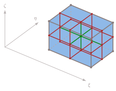

Below is an animation showing the child cells that are generated from splitting the parent hexahedron cell.

 

### Tetrahedron

When split isotropically, the tetrahedral cells split into 4 hexahedral cells. Consider the tetrahedron cell below.

 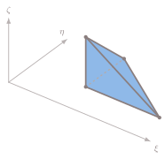

The diagram below shows the isotropic splitting stragegy applied to a tetrahedron cell.

 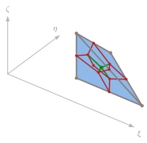

Below is an animation showing the child cells that are generated from splitting the parent tetrahedron cell.

 

### Prism

When split isotropically, the prism cells split into 6 hexahedral cells. Consider the prism cell below.

 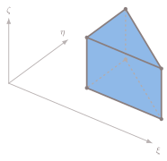

The diagram below shows the isotropic splitting stragegy applied to a prism cell.

 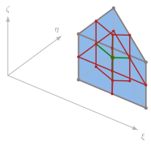

Below is an animation showing the child cells that are generated from splitting the parent prism cell.

 

### Pyramid

When split isotropically, the pyramid cells split into 4 hexahedral cells and 1 diamond cell. Consider the pyramid cell below.

 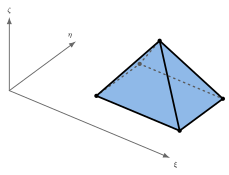

The diagram below shows the isotropic splitting stragegy applied to a pyramid cell.

 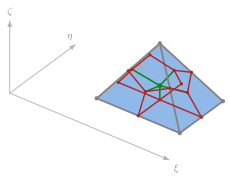

Below is an animation showing the child cells that are generated from splitting the parent pyramid cell.

 

### Summary

With this isotropic midpoint splitting behavior, there is a tendency towards hexahedral cells as isotropic refinement is applied.

- Hexahedra -> 8 smaller hexahedral cells
- Tetrahedra -> 4 hexahedral cells
- Prism cell -> 6 hexahedral cells
- Pyriamid cell -> 4 hexahedral cells + 1 diamond cell

## Midpoint Splitting Strategy

### Splitting Strategy Applied to Faces

A n-sided face is split into n faces by insering a node a the centroid location of the face, and then connecting that node to the midpoints of the n edges of the face.

1. Each edge of the face is split by insering a node at the midpoint.
2. For each N-sided face of the element:
   - A node is inerted at the centroid of the face.
   - A node at the midpoint of each edge is connected to the node at the face centroid. This forms N new edges.
   - Each node on the face lies exactly on two edges and forms a four-sided face with the midpoints of the two edges and the centroid of the face so that N four-sided faces are formed.

Below are some diagrams showing this process on a set of common face shapes.

 

3. For the N-faced element, that has E edges and V nodes:
  - Inert a new node at the centroid of the element
  - Connect that node to the centroid nodes of all the faces of the element.
  - This will create V new elements from the original element

## Anisotropic Splitting Strategy

Anisotropic refinement can be driven by edge or direction choices. This allows for a splitting that has a preferential direction. This is often related to cells that are in a boundary layer for example, where an isotropic splitting generates cells that are numerically unecessary. In a boundary layer for example, the direction perpendicular to the surface where the boundary layer cells are placed is the direction where additional resolution enhances the solution.

Cells such as the hexahedra and prisms can be split in special ways. A way of accounting for this information is to use special codes that can indicate the type of splitting to perform.

### Hexahedron

For the hexahedron shape, we can consider several ways of splitting the shape anisotropically. Here, we can use the idea of the split codes to keep things nicely accounted for. If we think of a hexahedral cell on a general set of coordinates (for simplicity you can think of x as xi, y and eta, and z as zeta).

* 0: no split.
* 1: split in the zeta direction. This creates two child hexahedra.
* 2: split in the eta direction. This creates two child hexahedra.
* 3: split in the eta and zeta directions. This creates four child hexahedra.
* 4: split in the xi direction. This creates two child hexahedra.
* 5: split in the xi and zeta directions. This creates four child hexahedra.
* 6: split in the xi and eta directions. This creates four child hexahedra.
* 7: split in all three directions. This is treated as the isotropic hexahedron case.

### Zeta Split(1)

For this split type, a set of edges aligned in the zeta direction are split using a midpoint splitting strategy. For one of the quadrilaterial faces of the hexahedra, this looks like two edges on the sides aligned with the zeta direction getting split and their newly inserted midpoints being connected with a new line. Below is a diagram showing the splitting and connection strategy for this type of splitting.

 

Below is an animation showing the children cells that are generated from this split.

 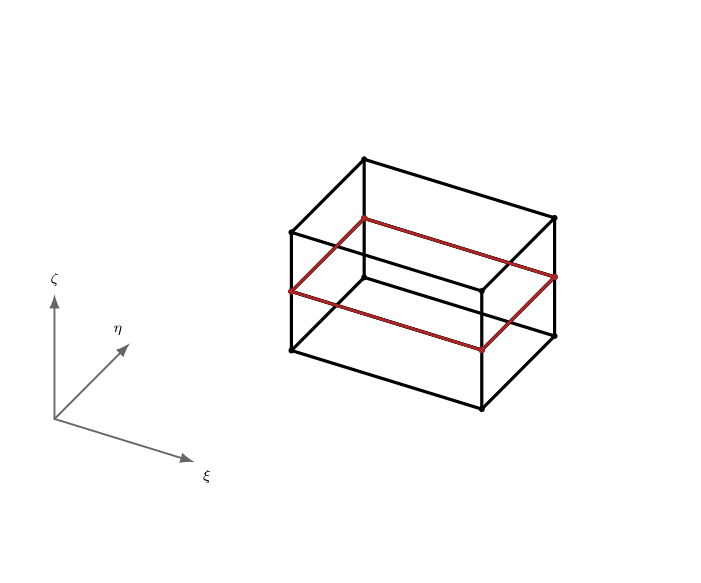

### Eta Split(2)

For this split type, a set of edges aligned in the eta direction are split using a midpoint splitting strategy. For one of the quadrilaterial faces of the hexahedra, this looks like two edges on the sides aligned with the eta direction getting split and their newly inserted midpoints being connected with a new line. Below is a diagram showing the splitting and connection strategy for this type of splitting.

 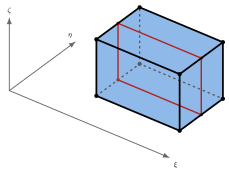

Below is an animation showing the children cells that are generated from this split.

 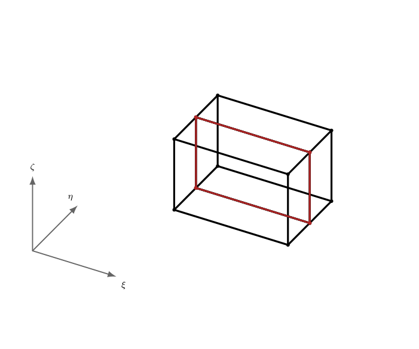

### Eta + Zeta Split(3)

For this split type, a set of edges aligned in the eta and zeta directions are split using a midpoint splitting strategy. This is a combination of two of the single-dimension splitting strategies. For one of the quadrilaterial faces of the hexahedra, this looks like two edges on the sides aligned with the eta and zeta directions getting split and their newly inserted midpoints being connected with a new line. Below is a diagram showing the splitting and connection strategy for this type of splitting.

 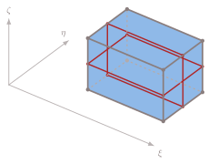

Below is an animation showing the children cells that are generated from this split.

 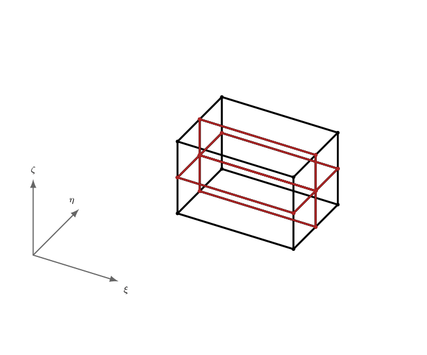

### Xi Split(4)

For this split type, a set of edges aligned in the xi direction are split using a midpoint splitting strategy. For one of the quadrilaterial faces of the hexahedra, this looks like two edges on the sides aligned with the xi direction getting split and their newly inserted midpoints being connected with a new line. Below is a diagram showing the splitting and connection strategy for this type of splitting.

 

Below is an animation showing the children cells that are generated from this split.

 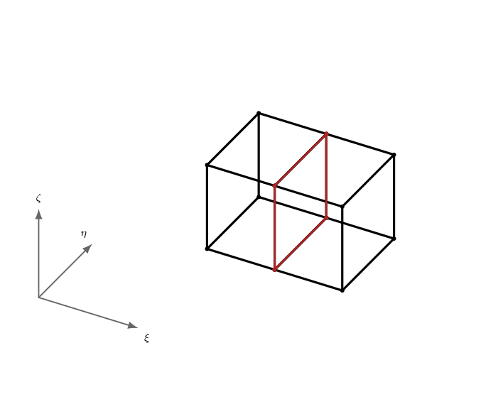

### Xi + Zeta Split(5)

For this split type, a set of edges aligned in the xi and zeta directions are split using a midpoint splitting strategy. This is a combination of two of the single-dimension splitting strategies. For one of the quadrilaterial faces of the hexahedra, this looks like two edges on the sides aligned with the xi and zeta directions getting split and their newly inserted midpoints being connected with a new line. Below is a diagram showing the splitting and connection strategy for this type of splitting.

 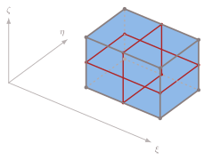

Below is an animation showing the children cells that are generated from this split.

 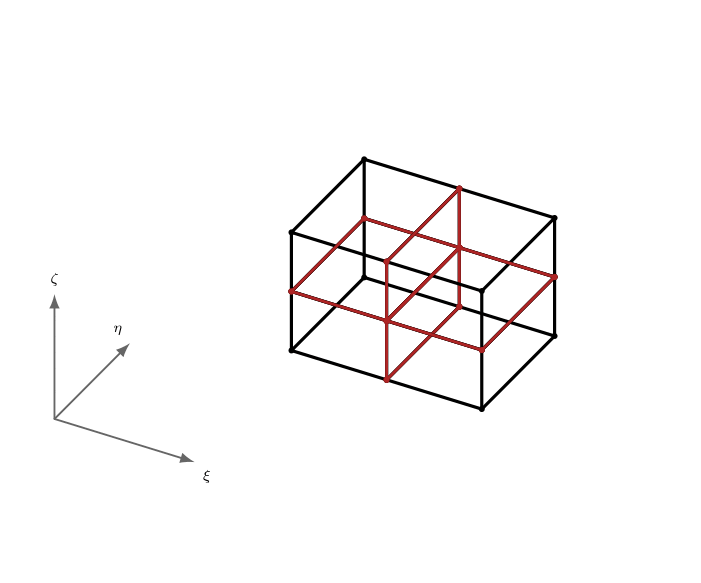

### Xi + Eta Split(6)

For this split type, a set of edges aligned in the xi and eta directions are split using a midpoint splitting strategy. This is a combination of two of the single-dimension splitting strategies. For one of the quadrilaterial faces of the hexahedra, this looks like two edges on the sides aligned with the xi and eta directions getting split and their newly inserted midpoints being connected with a new line. Below is a diagram showing the splitting and connection strategy for this type of splitting.

 

Below is an animation showing the children cells that are generated from this split.

 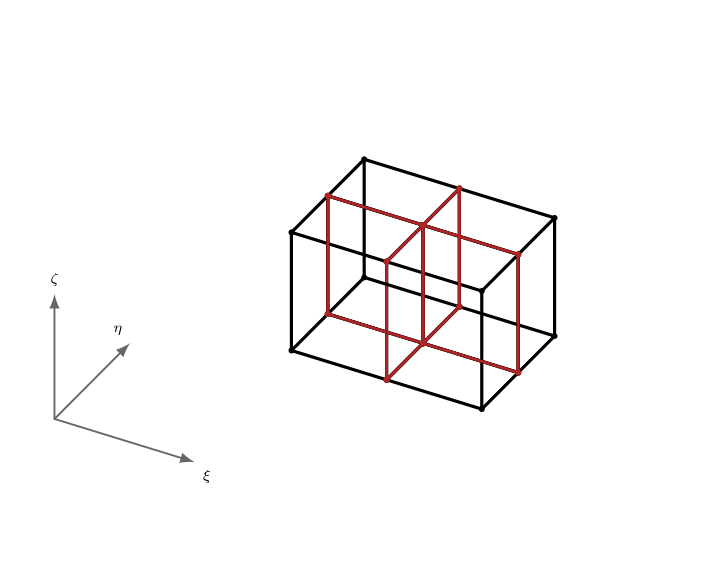

Of course a xi + eta + zeta splitting would just be the original isotropic midpoint splitting strategy, so it isn't shown here.
